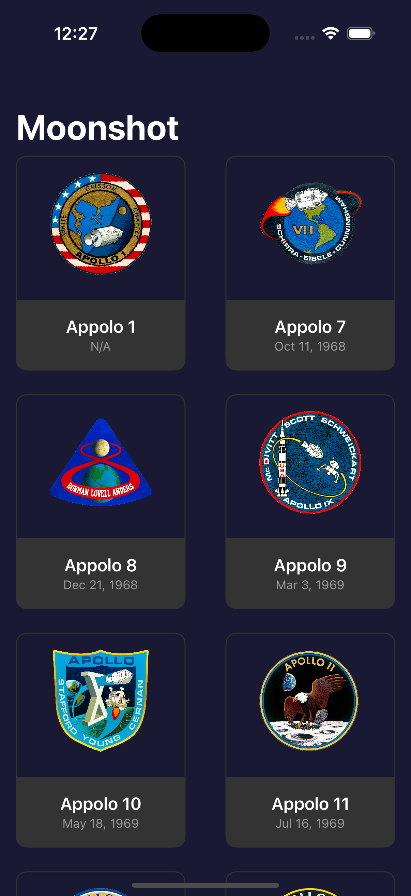
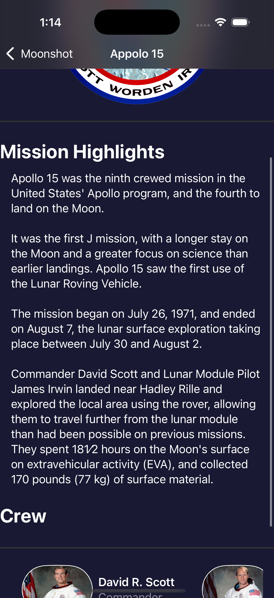

# Moonshot

Moonshot is an iOS app that lets users learn about the missions and astronauts that formed NASA’s Apollo space program. The app is built using **SwiftUI** and focuses on clean UI, data handling, and navigation.

## Preview (Work in Progress)




## Features (Planned & Implemented)

- [x] Display a list of Apollo missions
- [x] Show detailed information about astronauts
- [ ] Add interactive UI with animations
- [ ] Implement search and filtering
- [ ] Dark mode support

## Tech Stack

- **SwiftUI** – Declarative UI framework
- **Codable** – JSON parsing
- **NavigationStack** – For seamless navigation
- **AsyncImage** – Efficient image loading

## Installation (For Developers)

1. Clone the repository
   ```bash
   git clone https://github.com/Soumya98-dev/Moonshot.git
   ```
